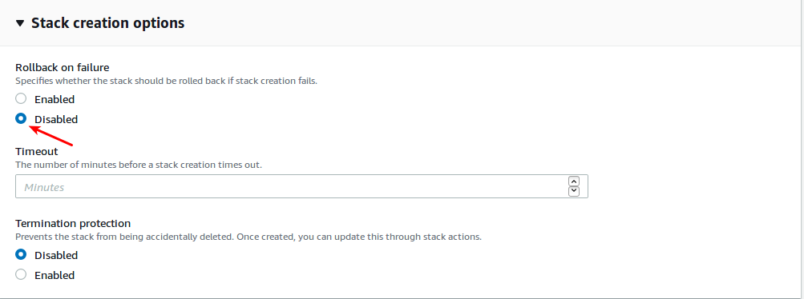

# AWS Deployment TroubleShooting

Sometimes things just doesn’t work as expected, but we’re here to help, to do that we’ll need some information about was going on in the instance when the deployment exploded.

So, the first step is start again, fill up the form and click next. In Configure stack options under Advanced Options and then in Stack creation options check Disabled under Rollback on failure. This will prevent the instance to be terminated in case of failure. 
Once you’ve configured this, you’ll be able to access the instance through ssh and recover some files.



Finish the deployment as usual.

## Logs files

### Deployment file

All the information regarding the deployment is written to `/var/log/cloud-init-output.log` we need this file to know if the fail came from the deployment.

### OpenVidu logs

OpenVidu writes its output to `/var/log/supervisor/openvidu-server-stdout---supervisor-ID.log` ID is a random string like fNvBt2.

To access this file you need to grant root access so run this command in the shell.

`$ sudo -s`

Now, all the command you executed will be under a privileged account. 

### Parameters

Well, this is not a file but we need to know what parameters do you set up during the configuration process. You can find this values in AWS CloudFormation Dashboard in the stack under Parameters.


## How to connect to the instance

When you filled up the form one of the parameters was an rsa key to grant you access to the instance. Now, you’ll need that key and the instance’ IP address. For example, if you key file is called `mi-key.pem` and the instance has an IP address like `12.13.14.15` you need to run this command from the shell

`ssh -i mi-key.pem ubuntu@12.13.14.15`

and then you will see something like this:

```
Welcome to Ubuntu 16.04.6 LTS (GNU/Linux 4.4.0-1077-aws x86_64)

 * Documentation:  https://help.ubuntu.com
 * Management:     https://landscape.canonical.com
 * Support:        https://ubuntu.com/advantage

  Get cloud support with Ubuntu Advantage Cloud Guest:
    http://www.ubuntu.com/business/services/cloud

54 packages can be updated.
25 updates are security updates.

New release '18.04.2 LTS' available.
Run 'do-release-upgrade' to upgrade to it.


Last login: Mon Apr 22 14:44:42 2019 from 85.58.224.197
To run a command as administrator (user "root"), use "sudo <command>".
See "man sudo_root" for details.

ubuntu@ip-172-31-35-250:~$
```

From here you can access the files with information about OpenVidu and the deployment.

## How get I the information from the file

Just run this command in the shell

`$ cat FILE`

Where _FILE_ can be one of the files we enumerated before. Remember become root before access OpenVidu logs.

If you want to read the file line by line just run:

`$ less FILE`

In a Linux Box you can use the keyboard shortcut **CRT+SHIFT+C** to copy the selected text.

## How can I identify the problem within the file

In the deployment file the last lines will show the problem, if unsure just send all the content to us.

The OpenVidu logs is more complex, but it’s a good idea looking for lines started by **ERROR**. If unsure, try to stop the OpenVidu server running this:

$ sudo supervisorctl stop openvidu-server

And then send to us all the content starting from something like this:

```
   ____               __      ___     _       
  / __ \              \ \    / (_)   | |      
 | |  | |_ __   ___ _ _\ \  / / _  __| |_   _     ___         
 | |  | | '_ \ / _ \ '_ \ \/ / | |/ _` | | | |   | _ \_ _ ___
 | |__| | |_) |  __/ | | \  /  | | (_| | |_| |   |  _/ '_/ _ \
  \____/| .__/ \___|_| |_|\/   |_|\__,_|\__,_|   |_| |_| \___/
        | |              
        |_|                            version X.Y.Z   
______________________________________________________________
```

To the end of file.
